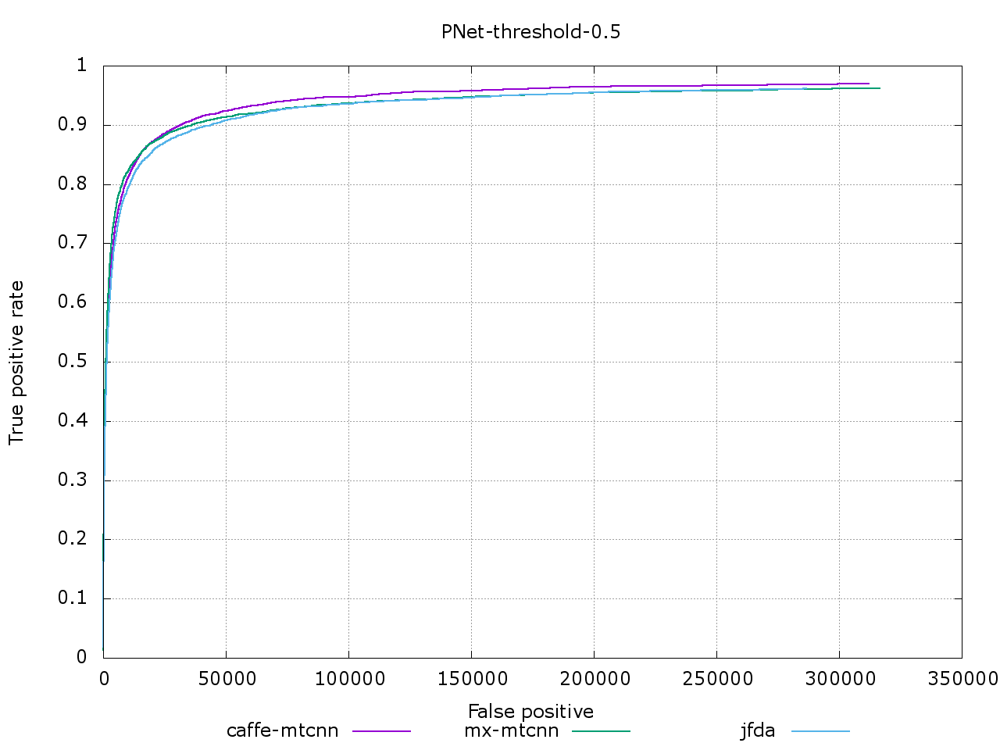
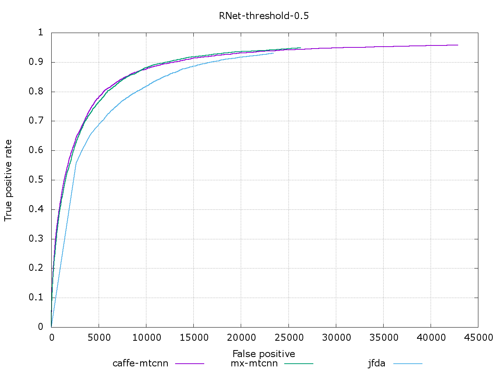
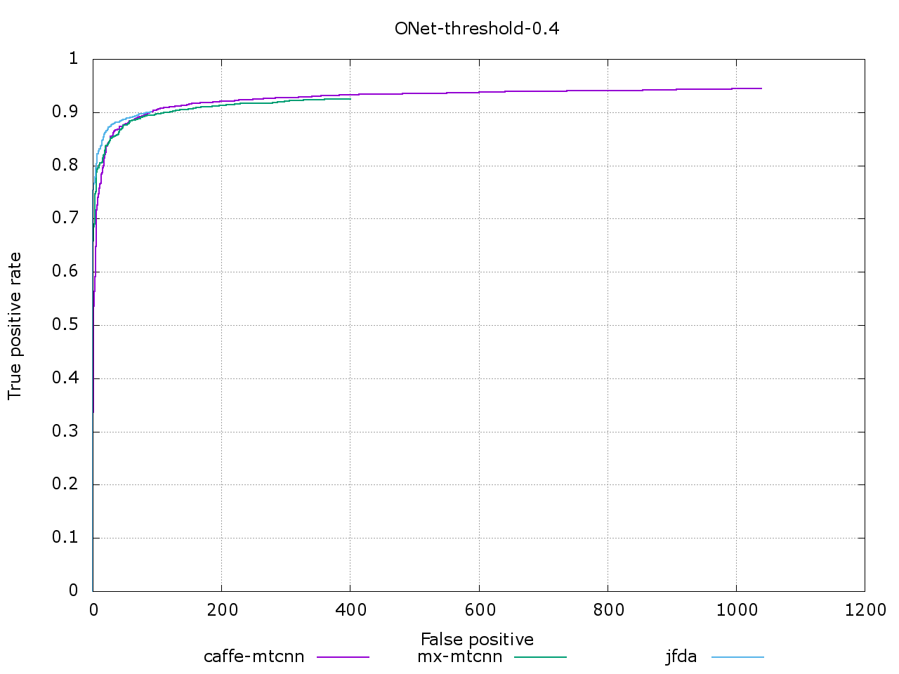
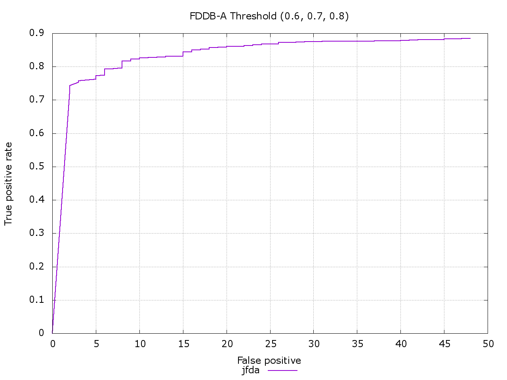
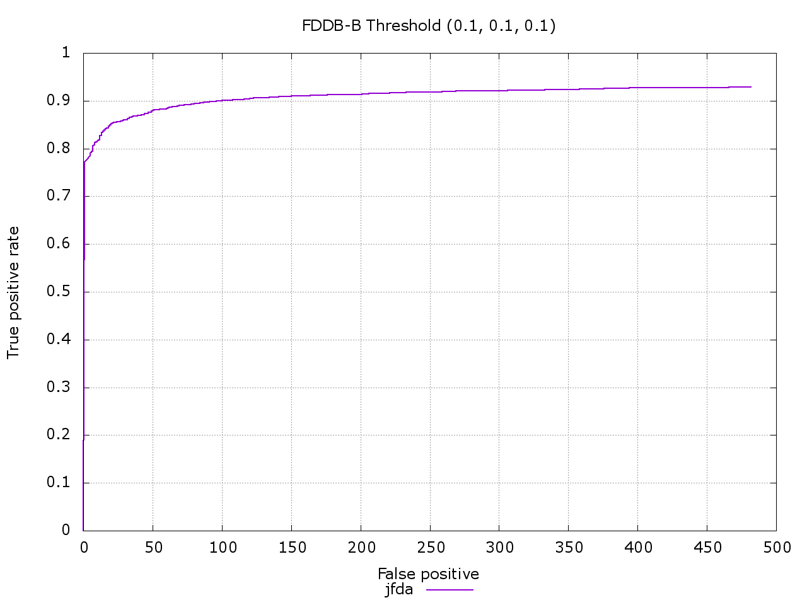
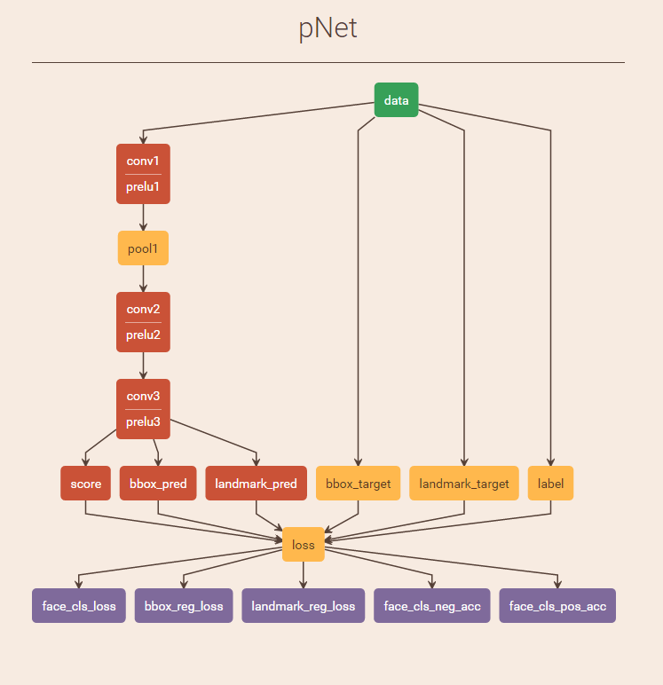
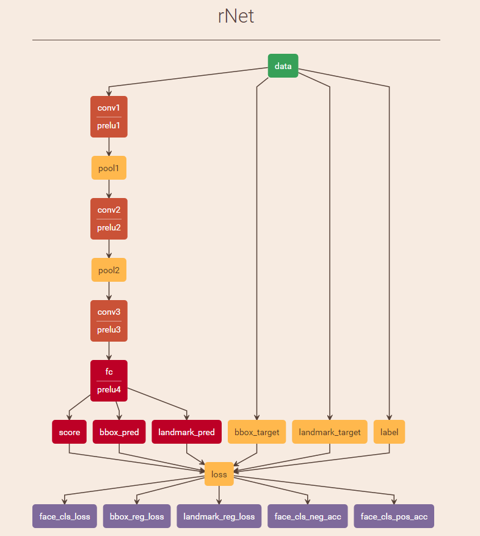
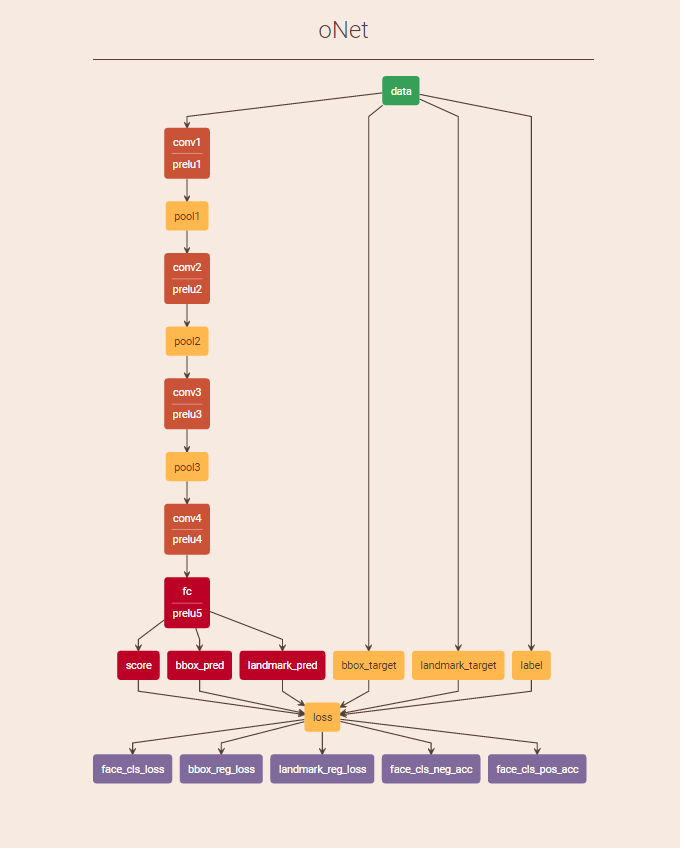
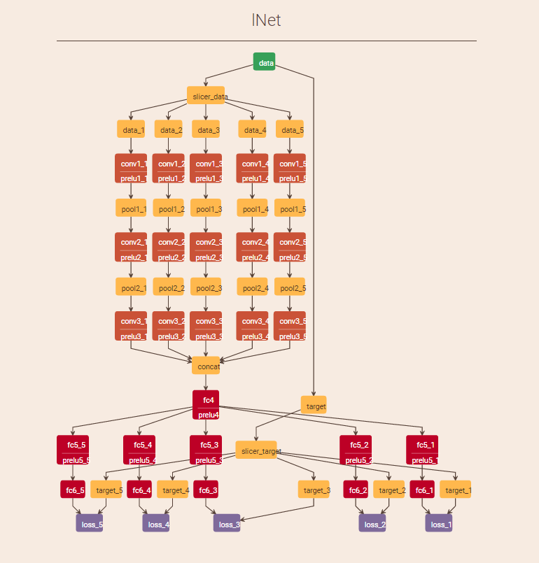

JFDA 总结
=========

这里总结了训练 JFDA 的过程。JFDA 是对 [Joint Face Detection and Alignment using Multi-task Cascaded Convolutional Networks](https://arxiv.org/abs/1604.02878) 这篇论文的复现。

JFDA 检测人脸的网络架构与之前一篇 [Cascade CNN](http://users.eecs.northwestern.edu/~xsh835/assets/cvpr2015_cascnn.pdf) 论文相似，都是针对传统级联方法在 DL 上的重现，区别在于传统方法使用到的分类器分类能力较弱，需要用 boost 提升方法，级联非常多的弱分类器来组成一个强分类器分类人脸。而 DL 的方法采用较小的 CNN 作为分类器，仅需若干个（一般采用 3 个）就能达到传统方法上千个分类器级联的分类效果。在实际检测人脸时，JFDA 与传统方法一致，采用了滑动窗口的方法来检测人脸，由于 CNN 的特性，JFDA 中的第一个网络（PNet）实际会设计成一个全卷积网络，从而实现快速的滑窗操作。对 JFDA 中的 3 个网络，我们简称为 PNet，RNet 和 ONet。

### 训练数据

训练 JFDA 的数据主要来做 WIDER 和 CelebA 这两个数据集，其中 CelebA 主要用来提供标有 5 个点的人脸用来训练 landmark 任务。WIDER Face 主要用来提供正样本（pos），负样本（neg）和局部人脸（part）。每一级的训练数据都是从这两个数据集中通过不同方式采集的。JFDA 将多个任务放在同一个网络中训练，包括了人脸分类（face cls），人脸框回归（bbox reg）和人脸关键点检测（landmark reg）。同时不同的样本可能参与的任务不一样，不像一般的多任务，每个样本都会有每个任务的标签，在这里，比如说负样本，它只有 face cls 的 label，并没有 bbox reg 和 landmark reg 的 label，实际处理数据送给网络计算 loss 也会有差异。

### 关于 loss

论文中提到了一种有别于传统 hard negative mining 的思路，叫做 online hard sample mining。传统级联方法的思路是用已有的分类器去检测训练图片，可以得到一些负样本，已有分类器没办法将这些负样本拒绝掉，因此称这些负样本为 hard negative，然后拿这些负样本去训练之后的分类器。JFDA 也有类似的操作，这个操作会在训练完网络之后，需要训练下一个网络的时候做，思路也这样，比如 RNet 的训练数据会来自 PNet 在训练数据集上的检测结果。但是论文中提到的 online hard sample mining 是在训练网络的同时做的操作，总体来说就是在训练过程中，丢掉一些简单样本的 gradient，让它们不参与之后的 bp，简单样本的鉴定就是看这个样本的 loss 值，loss 值高的样本是 hard 的，而 loss 值低的则认为是 simple 的，训练时按比例丢弃 simple 的 gradient，论文说这样做效果会提升，我没有做对比。

上面描述到的 loss 行为显然没法用原生的 Caffe Layer 来实现，这里采用了 C++ 单独写了一个 Loss Layer，将多个任务的 loss 计算全部合并到这个 Layer 中，同时完成 hard sample mining 的操作。这个 Layer 的实现也可以用 Python 写，但是当时采用了 C++ 编写，后面也没有改，Layer 使用时需要将相应代码 copy 到 Caffe 源码树中参与编译，这样就能够在 prototxt 中使用了。

### 训练数据的准备

这一步是整个 JFDA 中最为关键的一步，需要从 WIDER Face 中采集到 pos，neg 和 part 用于训练。我定义了一个 proposal 函数，函数的行为是给一张图片和这张图片中所有人脸的 ground truth，然后返回 pos，neg 和 part 数据。在实际 proposal 时，将每个 ground truth bbox 按一定比例放大后，通过不同的 scale 和 stride 进行滑窗操作，得到的框再根据与 ground truth 的 overlap 判断每个框是属于 pos，neg 还是 part。这里有一点需要非常注意，**一定要将滑窗区域做一下随机扰动**，不然滑窗出来的框在计算 bbox offset 时会有一个固定的模式（几个固定的值），严重影响后面 bbox reg 的训练。这里还有一点，判断 neg 时需要和图中所有 ground truth bbox 计算 overlap 才行，只和当前的 ground truth 计算是不对的。实际实现中，还可以针对 pos，neg 和 part 单独设置不同的 scale 和 stride 进行滑窗采样。

关于 neg 数据，上面在人脸区域中采集了一部分 neg 数据，同时也需要去整个图中随机 crop neg。我最开始的策略是所有 neg 来做整个图的随机 crop，这导致 PNet 在 fddb 上误检太多，在实际图片中使用模型，PNet 输出也非常多，但是 recall 基本还行，后来改成 50% 来自人脸区域附近，50% 来做整图，PNet 在 fddb 上的误检就少了很多，recall 基本没有影响，但是如果 100% 来自人脸区域，误检确实会很少，但是会导致 recall 降低。关于 50%，@tornadomeet 认为这个数值可能比较好。

RNet 和 ONet 需要用到前面网络做检测的输出，proposal 函数可以接受一个 detector 来表示，检测的结果直接去划分 pos，neg 和 part。关于 CelebA 数据的采样，也是同样调用的 proposal 函数，但是只取 pos 作为采样数据。同时由于 CelebA 图片较多较大，我最开始并没有用前面的网络去做检测，直接像处理 PNet 的数据一样处理后面两个网络的 landmark 人脸，这样做会导致 landmark 人脸数据比较多。后来我重新用 PNet，RNet 跑 CelebA 来准备数据，耗时比较大，但是 landmark 数据量少多了。

|Type           |Pos     |Neg       |Part   |Landmark   |
|---------------|--------|----------|-------|-----------|
|PNet-Train     |888351  |1179356   |970000 |1620790    |
|PNet-Val       |218478  |295192    |240000 |405200     |
|RNet-Train     |97642   |1585937   |250000 |353873     |
|RNet-Val       |24461   |393851    |60000  |89107      |
|ONet-Train     |142354  |38143     |90000  |360634     |
|ONet-Val       |35199   |9078      |20000  |89586      |

### Data Layer

每个 mini-batch 里 pos，neg，part 和 landmark 需要满足一定的比例（1:3:1:2），我针对不同的网络设置了不同的比例。我用 Python 写了 Data Layer，每个 mini-batch 都是在线组装的，同时以一定概率做 data augment，包括随机灰度化，随机 flip 人脸。这里需要注意的是 flip 操作会导致样本 label 的变化，一定要计算清楚，包括 bbox offset 的变换和 landmark 点的变换。如果不保持 mini-batch 里的样本比例也可以，但要做一下 gradient 的归一化，然后再把相应任务的 gradient 按比例 rescale，但是如果这样做，最好能够保证整个训练数据是按一定比例生成的，tornadomeet 采用了这种方法，训练结果没什么问题。

关于数据的加载，我采用的是 lmdb 格式，从性能上来衡量，只能说还行，网络较小时，io 开销明显有点大，关键在于 online data augment 会比较耗时，导致 GPU 负载不够，这个问题在 PNet 比较明显，ONet 稍微好些。Data Layer 我采用了生产消费模式，一个进程不停地从 lmdb 里加载各类数据，然后做 data augment 后进行 mini-batch 的组装，然后放到队列中。同时 Python 写的 Data Layer 作为消费者直接从队列中获取 batch 后交给网络去训练。

### 关于训练

训练主要是用的 Caffe 框架，结合自己的 Loss Layer，我针对性地输出了正负样本在 forward 时候的准确率，方便刻画误差，当然，原本的 softmax loss 也是可以看到的。任务之间的权值并没有做过多的调整，这里需要注意的是，mini-batch 中不同任务之间样本的比例已经是一种权值的刻画，但是在最后合并 loss 时还是加了额外任务的权值，这一步我没有细究，也没有做过多的调试，这里的两种比例是这样的，样本的比例刻画了数据集不同数据之间的分布，而任务的权值刻画了任务的重要性。训练参数的调节主要就是平时调 Caffe 模型的几个参数。这里我单独写了 train 的代码，因为 Caffe 训练参数中并没有 epoch 的概念，但是有每隔多少次迭代做测试的逻辑，我会每次根据数据集的大小和 batch size 的大小动态算出每个 epoch 需要迭代多少次，然后动态改变 solver 的参数来进行训练，其他参数的调整也是这个原理。因此不能直接用 caffe 命令来进行训练，必须用 train.py 来进行训练。

PNet 训练时的模型最好能够保证正样本的准确率 > 80%，负样本的准确率 > 97%，face cls loss 在 0.1 附近。以此保证在误检不多的情况下保证较高的召回率。

RNet 训练时的模型最好能够保证正样本的准确率 > 93%，负样本的准确率 > 99%，face cls loss 在 0.04 附近。

ONet 训练时的模型最好能够保证正样本的准确率 > 95.5% 以保证最后的 recall，负样本的准确率 > 95.5%，face cls loss 在 0.099 附近，landmark reg loss < 0.0008。ONet 本身由于训练数据约束，比较难训练。

具体训练参数查看 train.sh 里的配置。

### 关于 recall 和误检

目前在为后面网络准备数据时，设置的网络输出阈值均为 0.5，这个值可能比较大，导致后面网络的 recall 无法支撑，但是同时误检会少很多，可以考虑降低检测输出阈值，这个可以在 jfda/config.py 中修改。

### 关于 LNet

LNet 并没有出现在论文中，但是出现在作者公布的模型中，主要是做了 5 个关键点的修正，思路和之前 CUHK 做的 [Cascade CNN](http://mmlab.ie.cuhk.edu.hk/archive/CNN_FacePoint.htm) 思路一致，拿每个点附近的 patch 送到网络去预测点的修正，期望标点误差更低，考虑到各个 patch 来自人脸的不同区域，原作者采用了多个 branch 的子网络来做卷积，然后 concat feature 之后再针对各个点做 regression 训练，这里我们可以采用卷积的 group 参数达到相同的效果，如果不采用 group 而是直接用卷积在各个 patch 上操作，训练效果不好。采用 group 策略原则上跟多个子网络效果类似，但是这样做的好处是网络速度会有明显提升，同时我也压缩了网络的参数，进一步提高 LNet 的速度，用 cpp 代码做了相应的 benchmark，提升速度比较明显。训练时最好保证最后模型总的 loss 在 0.016 以下。

### 各个网络在 fddb 上的性能

caffe-mtcnn 是作者公布的模型在 mxnet 下性能，mx-mtcnn 是 @tornadomeet 在 mxnet 下的复现，这两者的数据由 @tornadomeet 提供，jfda 是我在 caffe 下的复现。

### 总体性能

我设置了不同的阈值来检测模型在 fddb 上的性能，fddb-a 中三个网络的阈值分别为 0.6,0.7,0.8。而 fddb-b 中三个网络的阈值分别为 0.1,0.1,0.1。

### 各个网络的图示

